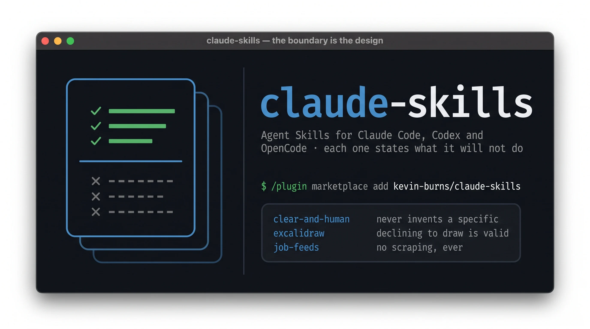

# claude-skills



Twenty-three [Agent Skills](https://agentskills.io) and nine subagents I build and maintain,
kept public so they can be versioned and shared. A skill is a directory with a `SKILL.md`;
some bundle scripts, evals or reference files. Subagents live under [`agents/`](./agents).

The name says Claude because that is where they started and where the subagents run. **The
skills themselves are the open Agent Skills format** and load unchanged in Claude Code, Codex
and OpenCode — this repo ships a plugin manifest for the first two.

All MIT (see [`LICENSE`](./LICENSE)). Skills wrapping an external tool carry a **Provenance**
note crediting the upstream project and its licence — MIT covers the skill content, not the
wrapped tools. [`CHANGELOG.md`](./CHANGELOG.md) records each addition: what it does, when to
reach for it, and what it deliberately won't do.

## Install

Three ways in. Pick by whether you want **all of them or one**, and **a snapshot or a live link**.

| | you get | updates |
|---|---|---|
| **Claude Code plugin** | all 23 skills + 9 subagents | `/plugin marketplace update`, deliberate |
| **Codex plugin** | all 23 skills | `codex plugin marketplace update`, deliberate |
| **Symlink** | whichever you pick | instant — it is a live link to this repo |

### Claude Code — the whole set

```bash
/plugin marketplace add kevin-burns/claude-skills
/plugin install claude-skills@kevin-burns
```

Skills arrive namespaced `claude-skills:<name>`.

### Codex — the whole set

```bash
codex plugin marketplace add https://github.com/kevin-burns/claude-skills
codex plugin add claude-skills@kevin-burns
```

Same namespacing. Subagents are the part that doesn't port: `agents/*.md` uses Claude Code's
frontmatter (`tools`, `model`), which Codex doesn't read. The skills travel, the fleet doesn't.

### Symlink — one at a time, live

```bash
ln -s "$(pwd)/clear-and-human" ~/.claude/skills/clear-and-human     # Claude Code, OpenCode
ln -s "$(pwd)/clear-and-human" ~/.agents/skills/clear-and-human     # Codex, OpenCode
ln -s "$(pwd)/agents/fact-verifier.md" ~/.claude/agents/fact-verifier.md
```

Symlinking keeps this repo the single source of truth — edits here are picked up immediately.
Take this path if you're editing the skills as well as using them, or if you want two of them
rather than twenty-three.

[OpenCode](https://opencode.ai/docs/skills/) needs no separate step: it already scans
`~/.claude/skills/` and `~/.agents/skills/`, so a symlink made for either of the others is
picked up with no second install.

### Two things worth knowing before installing the plugin

- **It copies.** A plugin install is a snapshot in the harness's cache, not a live link.
  Editing this repo afterwards changes nothing until you update.
- **It costs context.** Every skill's description loads in every session so the model can
  decide when to reach for one — about **5.9k tokens always-on** for the full set, before any
  skill fires. `claude plugin details claude-skills` prints the per-skill breakdown. If you
  want two or three of these, symlink those instead.

## Skills

| Skill | What it does | Wraps |
|---|---|---|
| [clear-and-human](./clear-and-human) | Construct, review, score, and rewrite prose so it reads human, not AI — with two optional stdlib scripts that measure register and check a rewrite invented nothing | — |
| [hook-and-human](./hook-and-human) | Write, punch up, and review persuasive marketing copy without fabricating | — |
| [cv-and-human](./cv-and-human) | Tailor a CV — or a LinkedIn profile (job-seeker lens) — to pass automated HR/ATS screening and Recruiter search while staying truthful and human — keyword/JD matching, parseability, de-slop, optional red-team | — |
| [cv-cover-letter](./cv-cover-letter) | Draft a cover letter from a job posting and your own CV: every claim traces to something you actually said, arithmetic-derived claims are flagged rather than asserted, and it **stops when the evidence stops** instead of filling a word count. Triages the posting's stated hard requirements first, so it can tell you not to apply **before** you spend the hour. Works standalone; markedly better after `cv-evidence-base`, which holds the facts a CV compresses away | — |
| [cv-evidence-base](./cv-evidence-base) | Interrogate a CV to recover the evidence that never made it onto the page, and grade which roles you are genuinely credible for — including the ones you are not. Runs *before* `cv-and-human`, when there is no target role yet | — |
| [frontier-rounds](./frontier-rounds) | Interview you in breadth-first rounds until a design is settled — the whole frontier per round with a recommended answer on every question, rather than one question at a time. Produces decisions, not deliverables | — |
| [c7search](./c7search) | Fetch up-to-date library docs via the `c7search` CLI | [Context7](https://context7.com) API |
| [markdown-converter](./markdown-converter) | Convert PDF/Office/HTML/media files to Markdown | [markitdown](https://github.com/microsoft/markitdown) (MS, MIT) |
| [ghost-publish](./ghost-publish) | Publish, update, schedule and verify Ghost posts from a markdown file — strips front matter Ghost would render as prose, and diffs what Ghost holds against the source in *both* directions | [ghst](https://github.com/TryGhost/ghst) (TryGhost, MIT) |
| [nano-banana-pro-json](./nano-banana-pro-json) | Generate/edit images (Gemini 3 Pro Image) with structured JSON control + photographic style presets, plus recipes for logos (with a free raster→SVG trace), product/e-commerce shots, and infographics — each with honest boundaries | Google Gemini image API |
| [convert-to-webp](./convert-to-webp) | Convert images to WebP for web projects | [libwebp](https://developers.google.com/speed/webp) `cwebp` / macOS `sips` |
| [social-image-prep](./social-image-prep) | Resize and format images for social platforms | `sips` / [ImageMagick](https://imagemagick.org) / [Pillow](https://python-pillow.org) |
| [terragrunt-skill](./terragrunt-skill) | Generate, validate, review, and debug Terragrunt 1.x configs (units, stacks, `autoinclude`, CAS, dependencies, AWS/Azure/GCP backends) — tracks current stable v1.1.0, incl. Azure backend gotchas and running only changed units at scale | — |
| [terraform-registry](./terraform-registry) | Provider-agnostic CLI to search/inspect the Terraform Registry via its JSON API (no scraping) | [Terraform Registry](https://registry.terraform.io) API |
| [source-snapshot](./source-snapshot) | Fetch external data once into pinned, provenance-stamped artifacts; resilient extractor fallback | [markitdown](https://github.com/microsoft/markitdown) / Defuddle / Readability |
| [dev-fleet](./dev-fleet) | Orchestration playbook driving the agent fleet through build → verify → review → commit | — |
| [report-builder](./report-builder) | Build self-contained single-page HTML reports/dashboards from data | [Jinja2](https://jinja.palletsprojects.com) / [Bootstrap 5](https://getbootstrap.com) / [Chart.js](https://www.chartjs.org) / [Plotly](https://plotly.com/javascript/) |
| [ux-audit](./ux-audit) | Heuristic usability + accessibility audit of rendered web pages (Nielsen + WCAG 2.2) | — |
| [job-feeds](./job-feeds) | Aggregate nine sanctioned public job feeds from eight publishers (JSON APIs + RSS) into one deduplicated SQLite store, match them against your career lanes, and render a filterable self-contained HTML report — no scraping, no auth, no LinkedIn | [Arbeitnow](https://www.arbeitnow.com) / [Jobicy](https://jobicy.com) / [Remotive](https://remotive.com) / [Remote OK](https://remoteok.com) / [Working Nomads](https://www.workingnomads.com) / [4 Day Week](https://4dayweek.io) / [We Work Remotely](https://weworkremotely.com) / [Python.org Jobs](https://www.python.org/jobs/) |
| [azadvertizer](./azadvertizer) | Offline lookups over Azure Policy / Initiative / RBAC-Role metadata + cross-references | [AzAdvertizer](https://www.azadvertizer.net) CSV exports |
| [use-linearis](./use-linearis) | Drive Linear.app from the CLI — issues, milestones, blocked-by relations, release filtering — plus the Linear↔Ogham dogfooding loop | [linearis](https://github.com/linearis-oss/linearis) CLI |
| [excalidraw-diagram](./excalidraw-diagram) | Generate Excalidraw diagrams that argue visually, with a render→view→fix loop (engine fetched once from a pinned, sha256-verified release, then offline) and optional cloud-icon (AWS/Azure/GCP) ingestion | [Excalidraw](https://github.com/excalidraw/excalidraw) (MIT; engine fetched at first render, fonts vendored); design forked from [coleam00](https://github.com/coleam00/excalidraw-diagram-skill); icon approach from [awesome-copilot](https://github.com/github/awesome-copilot) (MIT) |
| [trilium-capture](./trilium-capture) | File findings, clipped material and long-form documents into a self-hosted Trilium Notes instance — per project, one **closed** label vocabulary, documents revised in place so Trilium's own revision history replaces keeping `.bak` copies. Searches before writing; decides what does *not* belong there; never retrieves, and never touches a note it didn't write | [Trilium Notes](https://github.com/TriliumNext/Trilium) — its **built-in** MCP server |
| [travel-planning](./travel-planning) | Turn a trip into a paced day-by-day itinerary + a reconciled budget (Markdown); grounds cost estimates in typical/seasonal prices (labeled, sourced) — no booking, no live fares | — |
| [business-plan](./business-plan) | Build a realistic business plan (full plan + one-pager + investor summary) where every number is researched-and-cited, user-supplied, or computed from your assumptions — never invented; ends with an honest go/no-go/reshape verdict | — |

### Using these skills

Every skill directory has its own **`README.md`** — a plain-English guide to **what it does, how to use it well, and, just as importantly, what it does _not_ do.** Read that first; a skill's boundaries matter as much as its capabilities, and knowing what a skill deliberately refuses (invent a price, book a trip, predict a fare) is what keeps its output trustworthy.

A skill triggers **automatically** when your request matches its description — in Claude Code, claude.ai, Codex and OpenCode alike. You don't call it by name, you describe the task. Take the whole set or one directory (see [Install](#install)). This "what it does / what it doesn't do" README is the standard shape for every skill here — new skills ship one too (see [`CONTRIBUTING.md`](./CONTRIBUTING.md)).

## Agents

Subagents for software-development work, coordinated by the `dev-fleet` skill. Each is a `*.md` with frontmatter (`name`, `description`, `tools`, `model`) and a system-prompt body. Architecture and rationale: [`docs/agent-fleet-architecture.md`](./docs/agent-fleet-architecture.md).

| Agent | Role | Model |
|---|---|---|
| [azure-architect](./agents/azure-architect.md) | Enterprise-scale Azure / Cloud Adoption Framework design — governance, subscriptions, networking, IaC review | opus |
| [fact-verifier](./agents/fact-verifier.md) | Verify claims/code against authoritative sources — cite, refute, or return the lookup; never assert from memory | sonnet |
| [code-builder](./agents/code-builder.md) | Implement scoped changes TDD-style in an isolated worktree; commit on a branch, never push/merge/apply | sonnet |
| [coherence-checker](./agents/coherence-checker.md) | Structural fit of the implementation vs the plan/spec/verified facts — spec/plan traceability, inverse-pair round-trip (no normalization tricks), cross-impl parity, contract-docstring fidelity; read-only, gated on change complexity | sonnet |
| [code-reviewer](./agents/code-reviewer.md) | Advisory review for correctness, edge cases, contracts, security, tests — findings ranked by confidence (uncertain ones surfaced, not suppressed), not a gate | sonnet |
| [docs-reviewer](./agents/docs-reviewer.md) | Review docs (READMEs, ADRs, runbooks) for completeness, clarity, correctness, and audience fit | sonnet |
| [ux-auditor](./agents/ux-auditor.md) | Audit a rendered web page for usability/accessibility; renders via agent-browser/playwright-cli, fans out one per page (reads `ux-audit`) | sonnet |
| [commit-pr](./agents/commit-pr.md) | Write commit and PR/MR messages (reads `commit-style`) | haiku |
| [commit-style](./agents/commit-style.md) | Commit/PR style playbook used by `commit-pr` | — |

Several agents ship a deterministic behavioral eval under `agents/<name>/evals/` (run with `uv run python grade.py`).

`fact-verifier` and `cv-and-human`'s red-team Truth lens share one [portable verifier contract](./docs/verifier-contract.md) — never-assert-from-memory, cite/refute/return-the-lookup, read-only — with a per-domain *source profile*. Write a profile to get a verifier for a new domain without re-deriving the discipline.

## Requirements

- **c7search** — the `c7search` binary (`go install github.com/kevin-burns/c7search@latest`). A `CONTEXT7_API_KEY` is optional.
- **clear-and-human** — **nothing** for the writing itself; the skill is prose all the way down. Two optional scripts add measurement: `scripts/register_report.py` reports where a draft sits on the person and stiffness axes (each feature printed with the paper behind it, no score and no verdict), and `scripts/fidelity_check.py` diffs a draft against its rewrite and flags any number, quote, URL or code span that appeared, vanished or changed — a number present only in the rewrite is the shape of a fabricated statistic — plus the ranking, scope, comparison and requirement words the rewrite dropped, which is how an edit deletes a claim while looking like it deleted only style. Both are standard library only: `uv run` or `python3`.
- **frontier-rounds** — **nothing.** Prose all the way down. Two optional integrations, both degrading cleanly if absent: it reads the `nano` files from `software-design-rules` when a question turns on a design decision, and it can dispatch a sub-agent for read-only environment lookups.
- **job-feeds** — **nothing.** Standard library only, so `python3` works as a runner alongside `uv`. Verified running on Python 3.9 as recently as 2026-08-13, though CI now tests 3.12 and 3.13 only, so treat older interpreters as working-but-unwatched. No API keys, no accounts, no authentication — every source is a public feed. macOS, Linux, or WSL.
- **markdown-converter** — `uv` (uses `uvx markitdown`, no install needed).
- **nano-banana-pro-json** — `uv` and a `GEMINI_API_KEY` environment variable. No key is bundled.
- **convert-to-webp** — `cwebp` (`brew install webp`) or macOS `sips`. No install needed on macOS.
- **social-image-prep** — `sips` (macOS), ImageMagick, or `uv` (for the Pillow fallback). Uses whichever is present.
- **terragrunt-skill** — works as static review with no tooling; the bundled `scripts/validate.sh` uses `terragrunt` (1.x), plus optional `tflint` and `trivy` if present. `scripts/detect_custom_resources.py` runs on Python 3.
- **terraform-registry** — Python 3 (stdlib only). `search`/`inspect-module` need only network access; `inspect-resource`/`refresh-schema` additionally need the `terraform` CLI.
- **source-snapshot** — Python 3 (stdlib only). Uses whichever extractor is present: `markitdown` (via `uv`, the reliable fallback for docs/tables), and optionally Defuddle for prose articles (it strips page chrome). The producer auto-resolves the Defuddle runner — an installed `defuddle` binary, else `pnpm dlx` / `bunx` / `npx defuddle` (the `defuddle` package; `defuddle-cli` is deprecated/merged into it) — never pinning `@latest`, so caches are reused. Install once with `pnpm add -g defuddle` to avoid per-run fetches, or set `SNAPSHOT_DEFUDDLE_CMD` for a custom path. Degrades gracefully when one is missing.
- **cv-and-human** — no tooling for the core CV workflow (review, tailoring, de-slop). The optional red-team's measured ATS lens uses `scripts/ats_adversarial_loop.py` — `uv`/Python 3 (its `selftest` runs without a model backend). The LinkedIn profile mode uses `scripts/li_profile_check.py` and needs `uv`/Python 3.
- **dev-fleet** — no tooling; it's an orchestration playbook for the agents above.
- **report-builder** — `uv` (the bundled `scripts/render.py` declares its deps via PEP 723 inline metadata; run with `uv run`). Bootstrap/Chart.js/Plotly load from CDN, or vendor them for offline reports.
- **ux-audit / ux-auditor** — a browser driver to render pages: prefers `agent-browser`, falls back to `playwright-cli`; uses whichever is installed. Degrades to a static-HTML audit (clearly flagged) if neither is present.
- **use-linearis** — the `linearis` CLI (`npm i -g linearis`, Node; ships `linear` and `linearis` binaries) and a Linear API token via `linear auth login`. The Ogham dogfooding loop additionally uses the [`ogham`](https://github.com/ogham-mcp/ogham-cli) CLI (a local Go binary; hybrid search via `ogham search`).
- **excalidraw-diagram** — `uv` plus a one-time `uv run playwright install chromium`. Fonts are vendored under `references/vendor/`; the Excalidraw render engine is fetched once on first render from a pinned, sha256-verified GitHub Release (see `references/vendor/bundle.lock.json`), then cached and served locally — so the first render needs network, subsequent renders are offline. No Node needed at render time; Node + npm are needed only to re-vendor and republish a newer Excalidraw version via `references/scripts/vendor.sh`. Optional cloud/architecture icons (AWS/Azure/GCP/K8s) use user-supplied `.excalidrawlib` files ingested by stdlib scripts — no extra tooling; sets aren't bundled (own licenses).
- **azadvertizer** — `uv` (stdlib-only script via `uv run`); network only for the one-time `fetch`. Caches to `$XDG_CACHE_HOME/azadvertizer`; all queries run offline. Data © Julian Hayward / [AzAdvertizer](https://www.azadvertizer.net) — cache, don't hammer; not republished here.
- **trilium-capture** — a reachable Trilium instance (**v0.93.0+**) with its built-in MCP server at `/mcp`, authenticated with an ETAPI token as `Authorization: Bearer <token>`. Nothing to install: the server ships inside Trilium and shares its tool definitions with Trilium's own LLM chat — do **not** add a third-party Trilium MCP server. No scripts, no Python: the skill is conventions over tools Trilium already exposes. Optional: a short-memory store (e.g. Ogham) for the recall half of the split — without one, everything goes to Trilium.
- **cv-cover-letter** — none to install. You supply the posting (any source, not just LinkedIn), the CV you are sending, and optionally `evidence-base.md` from `cv-evidence-base`. Uses `clear-and-human` for register where available, and web search to read a posting from a URL — otherwise paste the text. It never invents a metric and never diagnoses the employer; see its [README](./cv-cover-letter/README.md).
- **travel-planning** — none to plan (pure instructions). Uses web search, if available, to ground cost estimates in typical/seasonal prices; degrades to a labeled estimate if a lookup fails. Optional: `report-builder` for an HTML version. It never books or reads live fares — see its [README](./travel-planning/README.md).
- **business-plan** — `uv` for the stdlib financials helper (`scripts/financials.py`, no runtime deps, run via `uv run`). Uses web search, if available, to research and cite market/competitor facts; where research fails it falls back to labeled placeholders rather than inventing. Optional: `report-builder` for an HTML version. It never invents a market size, competitor price, or revenue figure — see its [README](./business-plan/README.md).

## Contributing

Authoring or editing a skill? See [`CONTRIBUTING.md`](./CONTRIBUTING.md) — in particular the
**absolute-path + uv convention** for invoking a skill's bundled scripts, so they work from any
working directory rather than only this repo's root.
