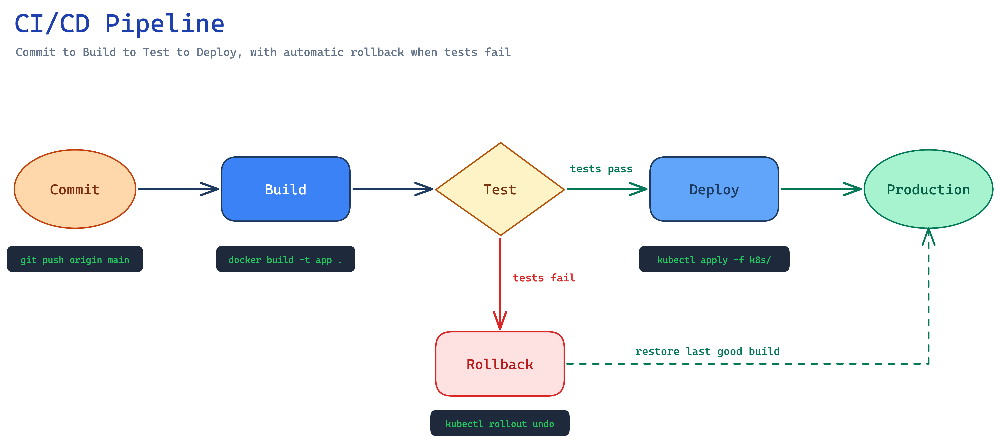
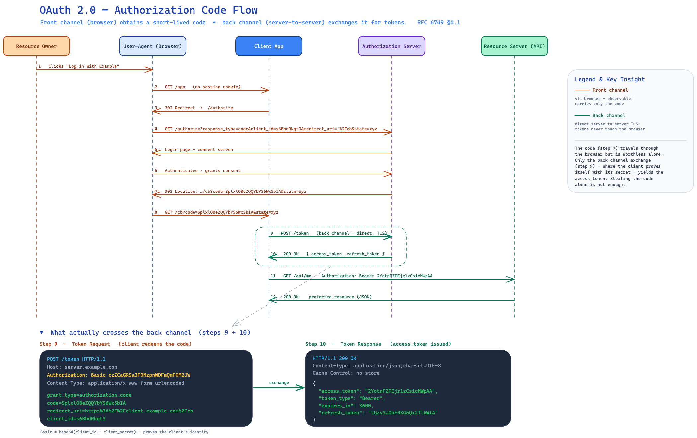

# Worked Examples

Reference diagrams that show this skill's methodology realized — not generic
type templates. Each is a real `.excalidraw` file paired with its rendered PNG,
so you can study both the JSON *and* the visual result. Read the one closest to
what you're drawing before you start; don't copy it, learn the moves.

Both were produced by following this skill end-to-end (design → JSON →
render → view → fix).

## cicd-pipeline — simple/moderate, conceptual-with-evidence

A left-to-right **assembly-line** flow (Commit → Build → Test → Deploy →
Production) with a **decision diamond** at Test that branches to a green
pass-path and a red fail-path into Rollback, plus a **dashed recovery arrow**
back to Production. What to steal from it:

- **Shape carries meaning:** ellipse for start/end, rectangle for process,
  diamond for the decision — not five identical boxes.
- **Color encodes the argument:** green = success path, red = failure path. The
  eye follows the outcome, not just the sequence.
- **Evidence chips:** small dark rectangles under each stage showing the *real*
  command (`git push origin main`, `docker build -t app .`,
  `kubectl rollout undo`). Concrete, teachable, not "Build".
- **Title + subtitle as free-floating text** for hierarchy — no box needed.

## oauth-authcode-flow — comprehensive/technical

A full **sequence diagram**: 5 actor lanes with lifelines and 12 numbered
messages, where **front-channel (orange) vs back-channel (green)** coloring
*is* the security argument. Below it, two **dark evidence panels** show the
actual RFC 6749 §4.1 token exchange — a real HTTP request and JSON response with
verified parameters (`grant_type=authorization_code`, `Authorization: Basic …`,
`access_token`, `token_type: Bearer`, `refresh_token`). What to steal from it:

- **Multi-zoom:** the sequence gives the overview; the evidence panels give the
  detail. Both on one canvas (see the "Multi-Zoom Architecture" section).
- **A "Key Insight" legend** that states what the diagram proves ("stealing the
  code alone is not enough") — the diagram argues, it doesn't just display.
- **Real evidence artifacts** sourced from the spec, not paraphrased.
- **Convention where it's expected:** a sequence diagram uses the sequence
  grammar readers know (lanes, lifelines, numbered messages) — that's
  correctness, not laziness.
- **Free-floating text is hand-wrapped with `\n`** (it does not auto-wrap; see
  `../element-templates.md`).

## Note on regenerating

These PNGs are committed on purpose (they show "what good looks like"). If you
edit an example's JSON, re-render it so the PNG matches:
`uv run python ../render_excalidraw.py <file>.excalidraw --scale 1`
